

  

**mlnote-note**は、岡崎 直観先生が作成された[機械学習帳](https://chokkan.github.io/mlnote/index.html)を40日間、ちょっとずつ毎日学ぶための教材です。

* 1日ごとの学習内容を1枚のスライドで要約して解説しています。
* 確認問題を解くのに集中できるよう、環境構築が不要なAmazon SageMaker Studio Labで確認問題を解いています(※)。
* スライドの作成に使ったPowerPointファイル`mlnote-slides.pptx`をリポジトリに含めているので、オリジナルを編集し自分なりの要約スライドを作れます。

※演習用のNotebookと、回答例を記入したNotebookはそれぞれ「Open Studio Lab」をクリックすると開けます。開くのにStudio Labのアカウントは不要です。動かすのに必要です。使い方は「学習を始める」のセクションを参照してください。

オリジナルの要約を作られた方は、ぜひ`40daysmlnote`で呟いていただけると嬉しいです！本リポジトリ内のスライドに誤りがあったりした場合は[Issues](https://github.com/icoxfog417/mlnote-note/issues)にてご連絡ください。

[著者が毎日チャレンジした様子はこちらから参照できます。](https://twitter.com/hashtag/30daymlnote?src=hashtag_click)

## 回帰

| Day | Lecture       | Summary |
|-----|---------------|---------|
|1    | [1.単回帰 1.1~1.4](https://chokkan.github.io/mlnote/regression/01sra.html)|   |
|2    | [1.単回帰 1.4~1.7](https://chokkan.github.io/mlnote/regression/01sra.html#a-b)|   |
|3    | [1.単回帰 確認問題](https://chokkan.github.io/mlnote/regression/01sra.html#id13) | 演習用:   回答例: |
|4    | [2.重回帰 2.1~2.8](https://chokkan.github.io/mlnote/regression/02mra.html)|   |
|5    | [2.重回帰 確認問題](https://chokkan.github.io/mlnote/regression/02mra.html#id17)| 演習用: 回答例 |
|6    | [3.モデル選択と正則化 3.1~3.3](https://chokkan.github.io/mlnote/regression/03regularization.html)| 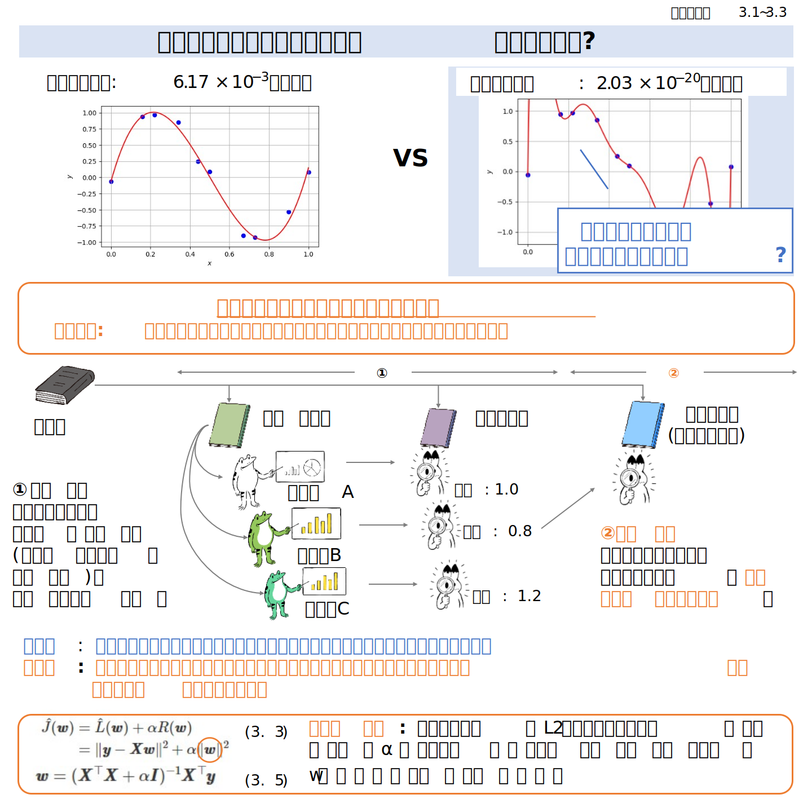 |
|7    | [3.モデル選択と正則化 確認問題](https://chokkan.github.io/mlnote/regression/03regularization.html#id4)| 演習用: 回答例: |
|8    | [4.勾配法によるパラメータ推定 4.1~4.4](https://chokkan.github.io/mlnote/regression/04sgd.html)|  |
|9    | [4.勾配法によるパラメータ推定 4.5~4.8](https://chokkan.github.io/mlnote/regression/04sgd.html#id10)| 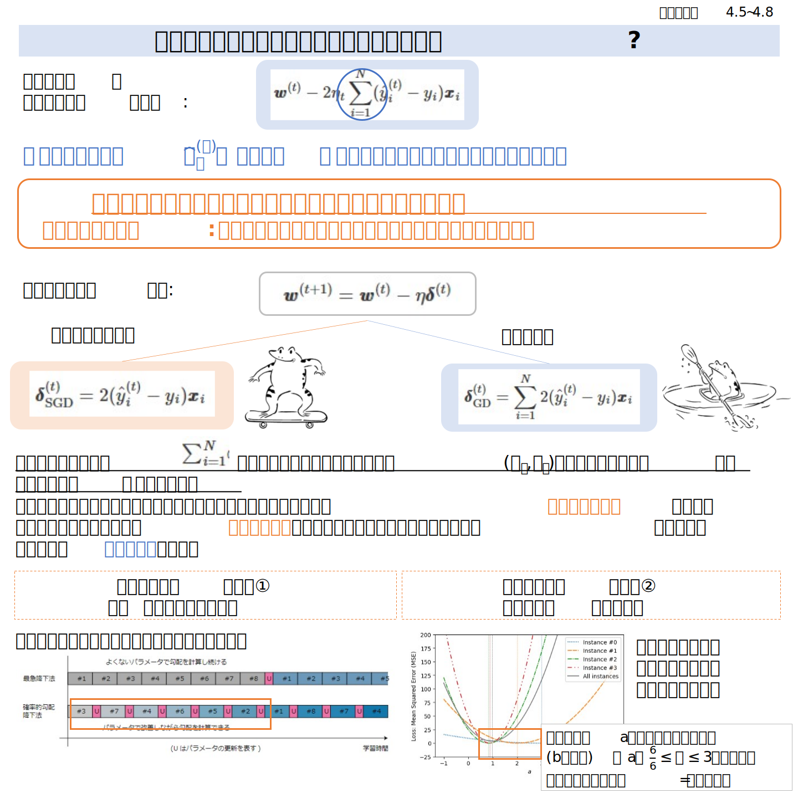 |
|10   | [4.勾配法によるパラメータ推定 確認問題](https://chokkan.github.io/mlnote/regression/04sgd.html#id20) | 演習用:  回答例: 

## 分類

| Day | Lecture       | Summary |
|-----|---------------|---------|
|11   | [5.線形二値分類 5.1~5.4](https://chokkan.github.io/mlnote/classification/01binary.html)|   |
|12   | [5.線形二値分類 5.5~5.7](https://chokkan.github.io/mlnote/classification/01binary.html#id7)|   |
|13   | [5.線形二値分類 5.8](https://chokkan.github.io/mlnote/classification/01binary.html#id11)| 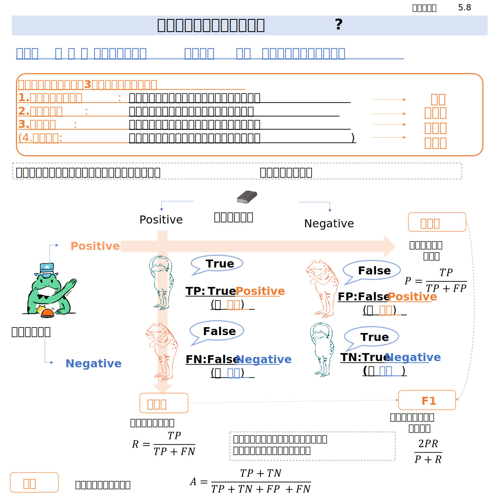  |
|14   | [5.線形二値分類 確認問題](https://chokkan.github.io/mlnote/classification/01binary.html#id19)| 演習用: 回答例: |
|15   | [6.線形多クラス分類 6.1~6.6](https://chokkan.github.io/mlnote/classification/02multi.html)| 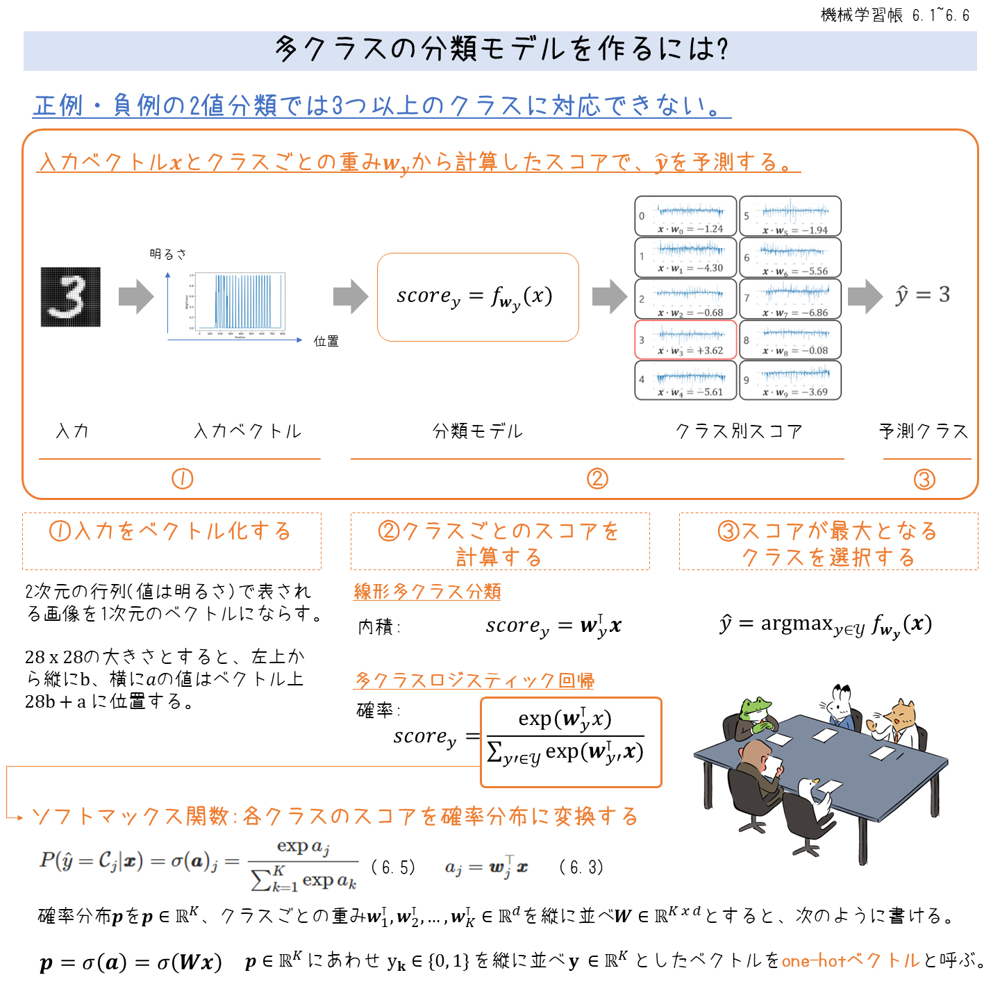  |
|16   | [6.線形多クラス分類 6.7~6.8](https://chokkan.github.io/mlnote/classification/02multi.html#id10)| 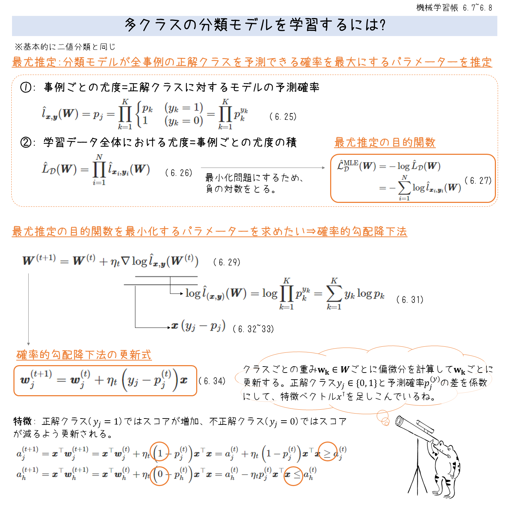  |
|17   | [6.線形多クラス分類 6.9](https://chokkan.github.io/mlnote/classification/02multi.html#id13)|   |
|18   | [6.線形多クラス分類 確認問題](https://chokkan.github.io/mlnote/classification/02multi.html#id16)| 演習用: 回答例:  |
|19   | [7.ニューラルネットワーク (1) 7.1~7.2](https://chokkan.github.io/mlnote/classification/03nn.html) |  |
|20   | [7.ニューラルネットワーク (1) 7.3](https://chokkan.github.io/mlnote/classification/03nn.html#id18) | 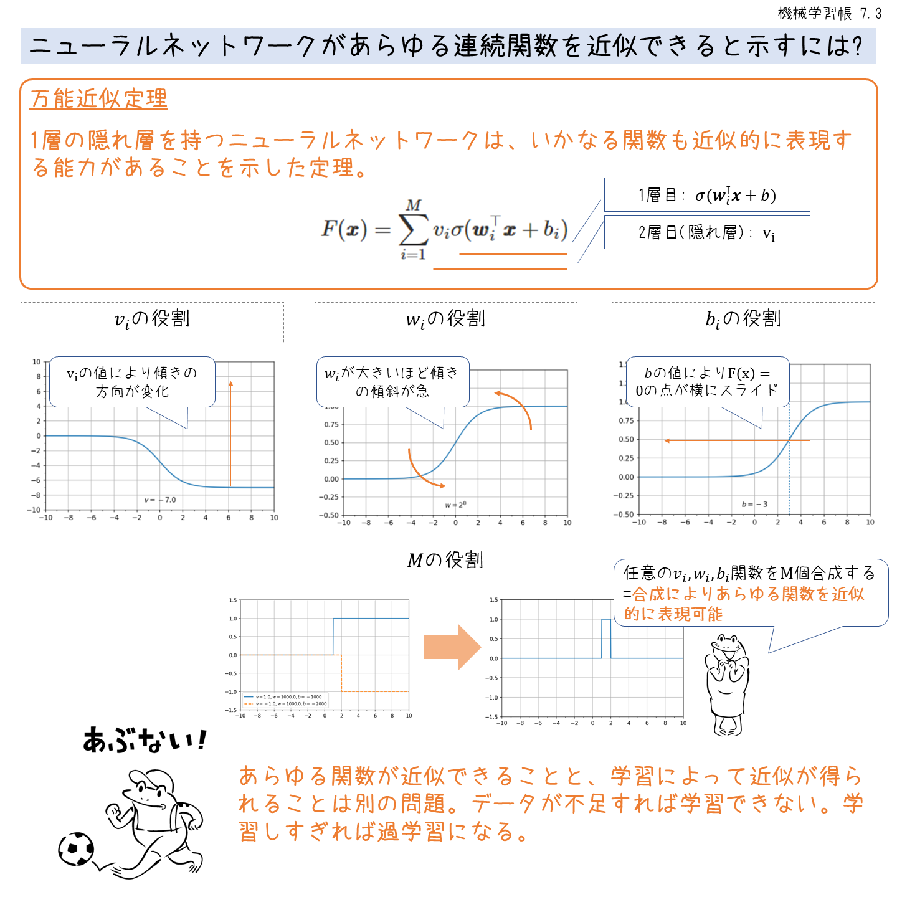 |
|21   | [7.ニューラルネットワーク (1) 確認問題](https://chokkan.github.io/mlnote/classification/03nn.html#id21)| 演習用: 回答例: |
|22   | [8.ニューラルネットワーク (2) 8.1](https://chokkan.github.io/mlnote/classification/04nntrain.html) |  |
|23   | [8.ニューラルネットワーク (2) 8.2~8.3](https://chokkan.github.io/mlnote/classification/04nntrain.html#nn) |  |
|24   | [8.ニューラルネットワーク (2) 確認問題(8.4)](https://chokkan.github.io/mlnote/classification/04nntrain.html#id13)| 演習用: 回答例:|
|25   | [8.ニューラルネットワーク (2) 確認問題(8.5)](https://chokkan.github.io/mlnote/classification/04nntrain.html#id13)| 演習用: 回答例:|
|26   | [9.サポートベクトルマシン 9.1~9.2](https://chokkan.github.io/mlnote/classification/05svm.html) |  |
|27   | [9.サポートベクトルマシン 9.4](https://chokkan.github.io/mlnote/classification/05svm.html#id6) | 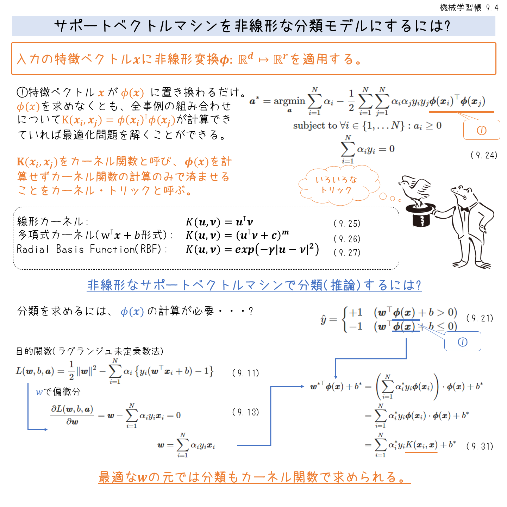 |
|28   | [9.サポートベクトルマシン 9.3,9.5](https://chokkan.github.io/mlnote/classification/05svm.html#svm)| |

## 教師無し学習

| Day | Lecture       | Summary |
|-----|---------------|---------|
|29   | [10.非階層的クラスタリング 10.1~10.2](https://chokkan.github.io/mlnote/unsupervised/01kmeans.html) | 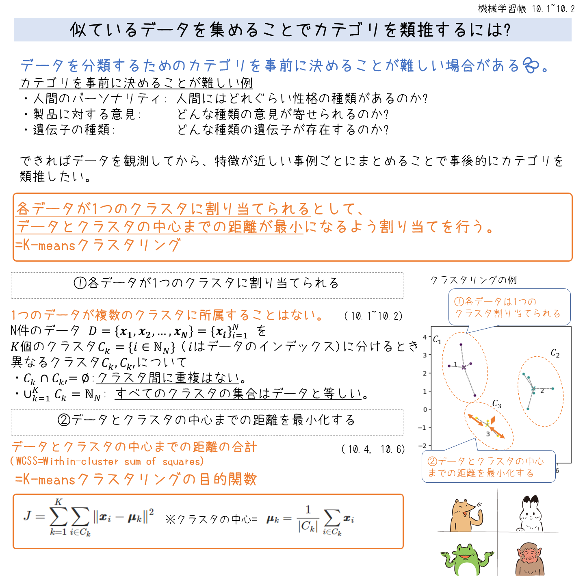 |
|30   | [10.非階層的クラスタリング 10.3~10.4,10.6~10.8](https://chokkan.github.io/mlnote/unsupervised/01kmeans.html#lloyd) |  |
|31   | [10.非階層的クラスタリング 確認問題](https://chokkan.github.io/mlnote/unsupervised/01kmeans.html#id20) | 演習用: 回答例: |
|32   | [11.階層的クラスタリング 11.1~11.2](https://chokkan.github.io/mlnote/unsupervised/02hac.html) | 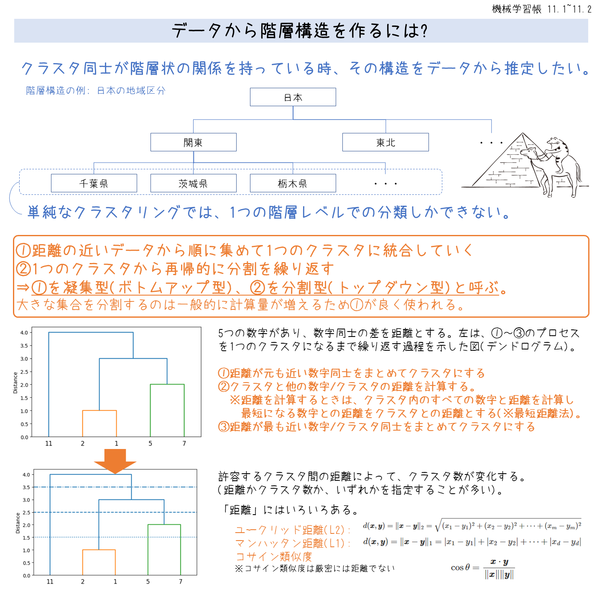 |
|33   | [11.階層的クラスタリング 11.3](https://chokkan.github.io/mlnote/unsupervised/02hac.html#id10) | 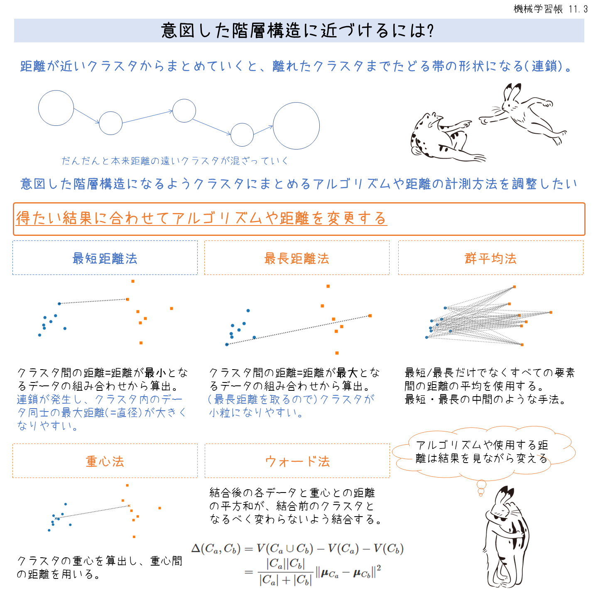 |
|34   | [11.階層的クラスタリング 確認問題](https://chokkan.github.io/mlnote/unsupervised/02hac.html#id19) | 演習用: 回答例:|
|35   | [12.主成分分析 (1) 12.1~12.3, 12.5](https://chokkan.github.io/mlnote/unsupervised/03pca.html) |  |
|36   | [12.主成分分析 (1) 12.4](https://chokkan.github.io/mlnote/unsupervised/03pca.html#id5) | 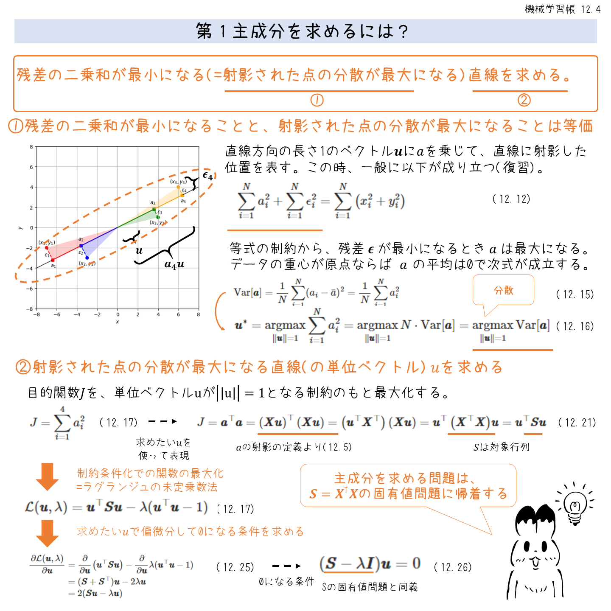 |
|37   | [12.主成分分析 (1) 確認問題](https://chokkan.github.io/mlnote/unsupervised/03pca.html#id8) | 演習用: 回答例:|　|
|38   | [13.主成分分析 (2) 13.1~13.2](https://chokkan.github.io/mlnote/unsupervised/04pca2.html) | 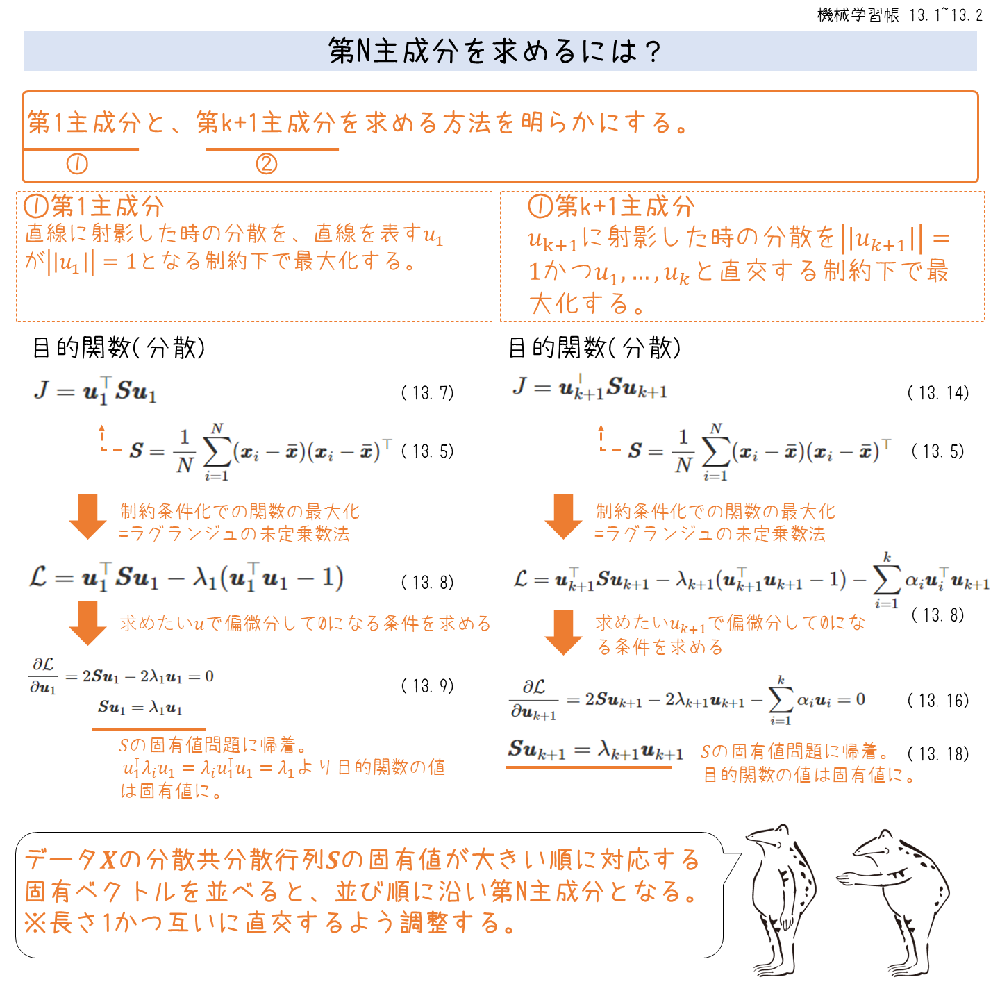 |
|39   | [13.主成分分析 (2) 13.3](https://chokkan.github.io/mlnote/unsupervised/04pca2.html#id7) | 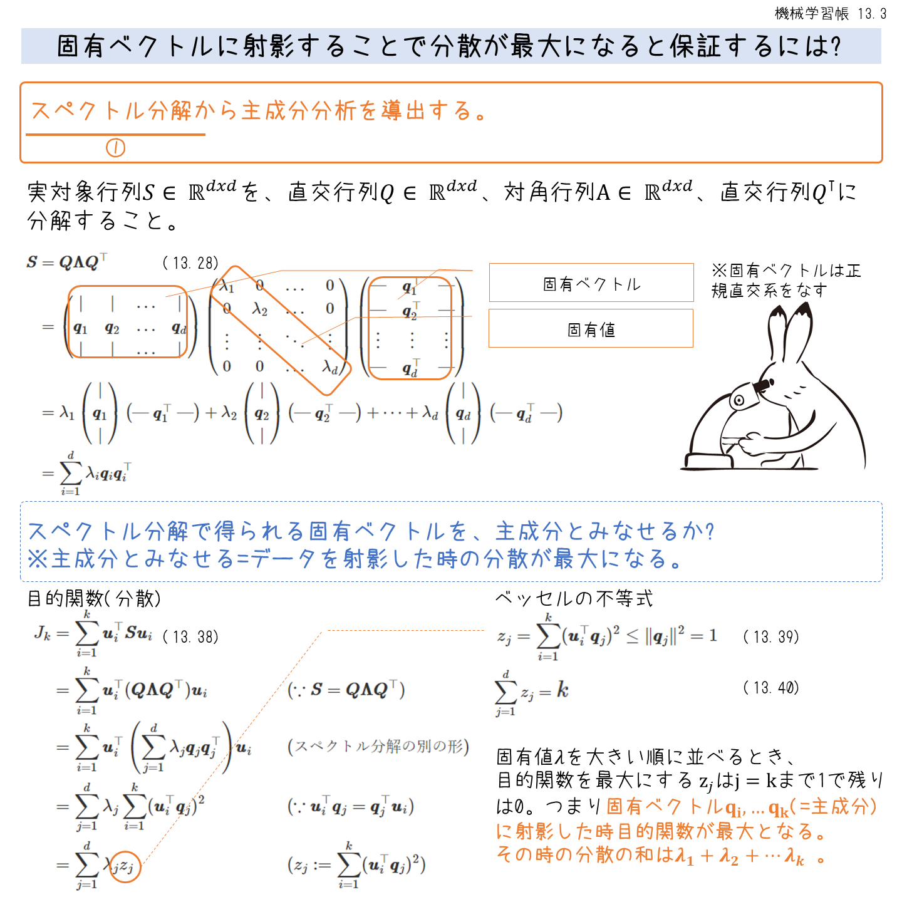 |
|40   | [13.主成分分析 (2) 13.5](https://chokkan.github.io/mlnote/classification/05svm.html#svm)| |

## 学習を始める

### Studio Labを使う

Studio Labは、ブラウザ上でJupyterLabの環境が利用できるサービスです。メールアドレスのみ、無料で利用が可能です。詳細は[Amazon SageMaker Studio Lab の使い方](https://github.com/aws-sagemaker-jp/awesome-studio-lab-jp/blob/main/README_usage.md)、アカウントのリクエストは[Request Account](https://bit.ly/3sB7nC3)よりできます。

### ローカル環境を使う

[Miniconda](https://docs.conda.io/en/latest/miniconda.html)をインストールした後、次のコマンドで環境を構築できます。

`conda env create --file environment.yml`

Windowsの場合は`environment-windows.yml`を使ってください。
